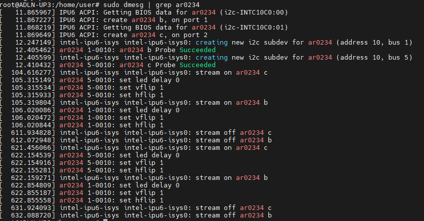
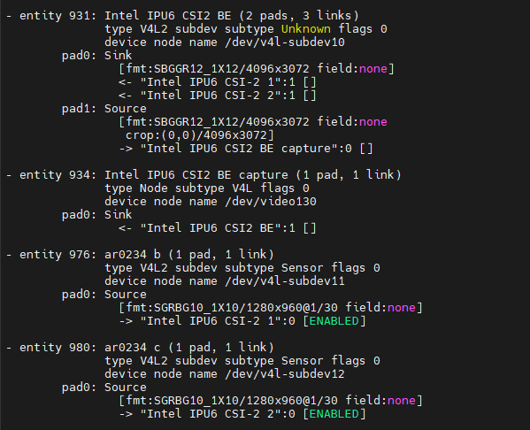
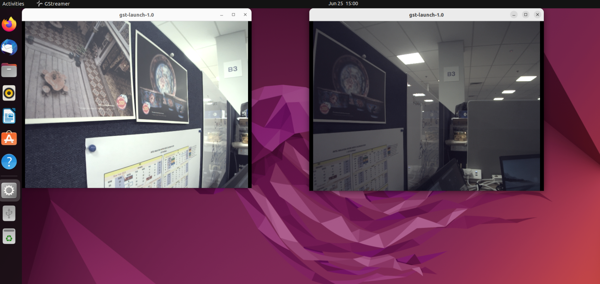
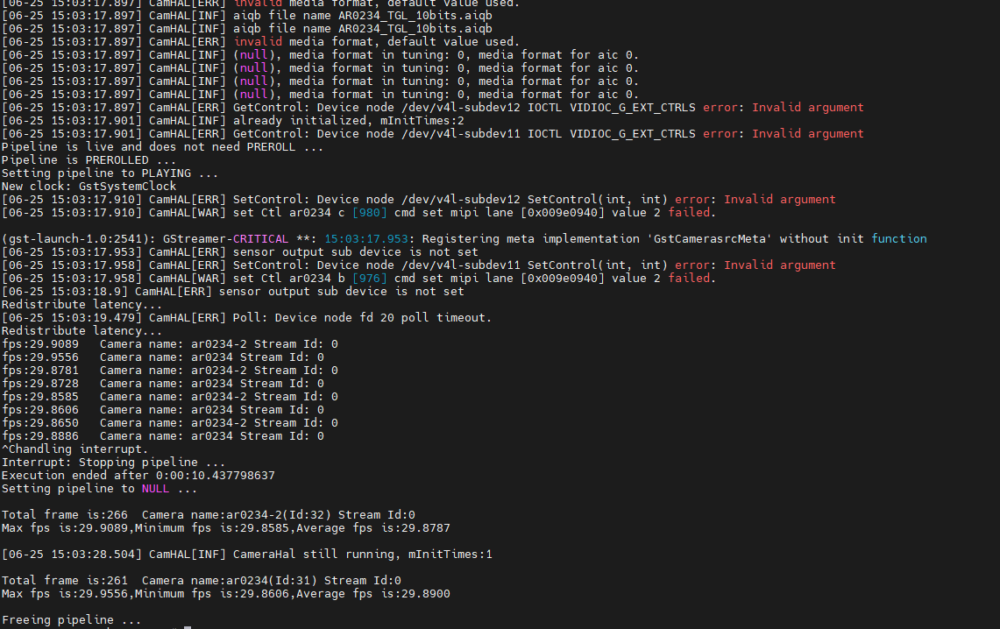

# MIPI AR0234 Setup Guide

This is setup guide for enabling MIPI AR0234 for Intel® Alder-Lake N processor.

## Requirements

Ensure that your system is set up properly. 
1. ADLN Setup: Refer to [ADLN Setup tutorial](../../README.md)
2. ADLN BIOS Setup: Refer to [BIOS Setup for MIPI AR0234](./BIOS_README.md)

#### Validated Hardware
- [AAEON UP Squared Pro 7000 (UPN-ADLNI3-A10-1664)](https://www.aaeon.com/en/p/up-board-up-squared-pro-7000)
- [D3 AR0234 MIPI](https://www.d3engineering.com/product/ar0234-medium-fov-samtec-mipi-unsealed/)

## Go to specific setup directory

This step will redirect user to the current platform setup directory

```bash
cd edge-developer-kit-reference-scripts/platforms/atom/adln/mipi/ar0234
```

## Install IPU libraries
1. Run below script to install userspace IPU libraries. 
   ```
   cd edge-developer-kit-reference-scripts/platforms/atom/adln/mipi/ar0234/scripts
   ./install_ipu.sh
   ```

2. After installing userspace IPU libraries, run below script to setup userspace IPU libraries. The system reboots after this command.
   ```
   ./setup_ipu.sh
   ```

3. To ensure IPU FW is probed and loaded properly, run this command.
   ```
   sudo dmesg | grep ipu
   ```
   

4. Lastly check if AR0234 sensor(s) are detected.
   ```
   sudo dmesg | grep ar0234
   ```
   
   ```
   media-ctl -p
   ```
   

### Video Loopback Setup
1. In order to use v412 API with AR0234 MIPI camera, run following commands
   ```
   sudo modprobe v4l2loopback devices=2
   ```
   > devices=x (number of AR0234 cameras connected)

2. You will get the video device name by running following command.
   ```
   ls -1 /sys/devices/virtual/video4linux
   ```
   > Take note the device name (e.g. video131)

3. Run the following command to enter root mode.
   ```
   sudo bash
   ```

3. Set environment variables with following commands.
   ```
   source setup_camera_env.sh
   ```

### AR0234 Camera Stream

#### Using icamerasrc
1. Launch the following command to see 
      #### Single camera stream
      ```
      gst-launch-1.0 icamerasrc device-name=ar0234 printfps=true ! video/x-raw,format=NV12,width=1280,height=960 ! videoconvert ! xvimagesink
      ```

      #### Dual camera stream
      ```
      gst-launch-1.0 icamerasrc device-name=ar0234 printfps=true ! video/x-raw,format=NV12,width=1280,height=960 ! videoconvert ! xvimagesink icamerasrc device-name=ar0234-2 printfps=true ! video/x-raw,format=NV12,width=1280,height=960 ! videoconvert ! xvimagesink
      ```

#### Stream output
The images below shows the output for 2 AR0234 camera streams.




## Next Steps

Refer to the available use cases and examples below

1. [Intel® Distribution of OpenVINO™ Toolkit](../../../usecases/openvino/README.md)
2. [Intel® Edge Software Hub](https://www.intel.com/content/www/us/en/developer/topic-technology/edge-5g/edge-solutions/overview.html) 

